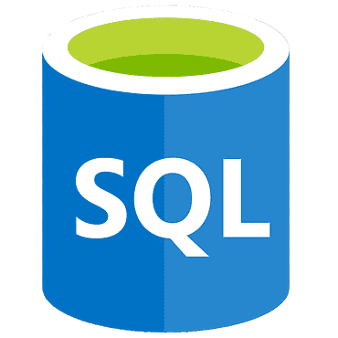

### About Me:

I'm a passionate data scientist with a knack for predictive analytics, specializing in recurrent neural networks (RNN) and LSTM models. I thrive on tackling regression tasks and exploring the fascinating realm of reinforcement learning (RL). Additionally, I have a strong foundation in classical machine learning and possess the requisite mathematical prowess.

Currently, I'm delving into the realms of decentralized finance (DeFi) and web3, where I'm actively engaged in crafting and analyzing smart contracts. During my leisure time, you'll find me honing my problem-solving skills on LeetCode and participating in CTF challenges.
      
   
### Contact Me:  

### Working on:

- Learning [GO](https://github.com/sammorozov/go_basics_study)
- [fullstack web3 development course](https://github.com/sammorozov/full_course_crypto_32) 
- [ethernaut tasks](https://github.com/sammorozov/ethernaut_source_tasks)
- Various bots and scripts, with results showcased [here](https://t.me/from_the_teapot_to_the_investor)

## Languages and Tools 

### Languages:
| Python3 | SQL |
|----------|-----|
|   |  |  | |  |  | |

### Tools for Data Manipulation and Visualization:

| Jupyter | Postgres | Tableau |
|----------|----------|----------|
||||

